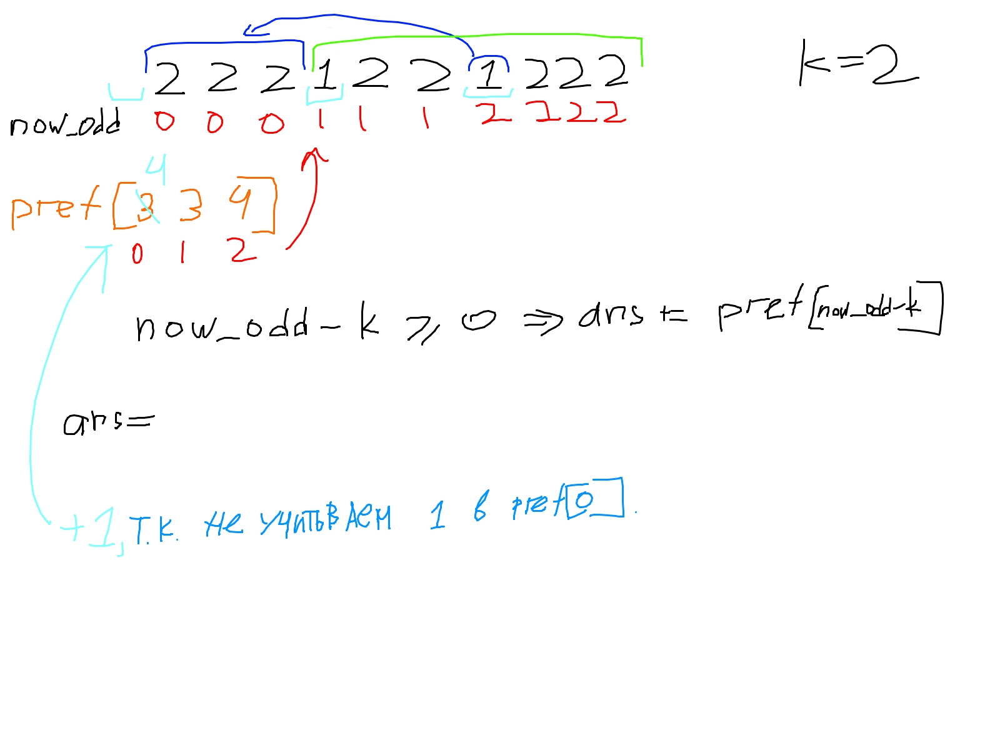

https://leetcode.com/problems/count-number-of-nice-subarrays/description/?envType=daily-question&envId=2024-06-22

Метод решения - преффиксные суммы.

Массив **pref** -> поддерживиет количество четных чисел + 1 для *ind* нечетных чисел c начала отрезка pref\[*ind*\]

Т.е. когда у нас количество нечетных чисел например 2, как К -> мы каждый раз прибавляем количество суффиксов, которые подходят для этого подотрезка
pref[now_odd-k]

