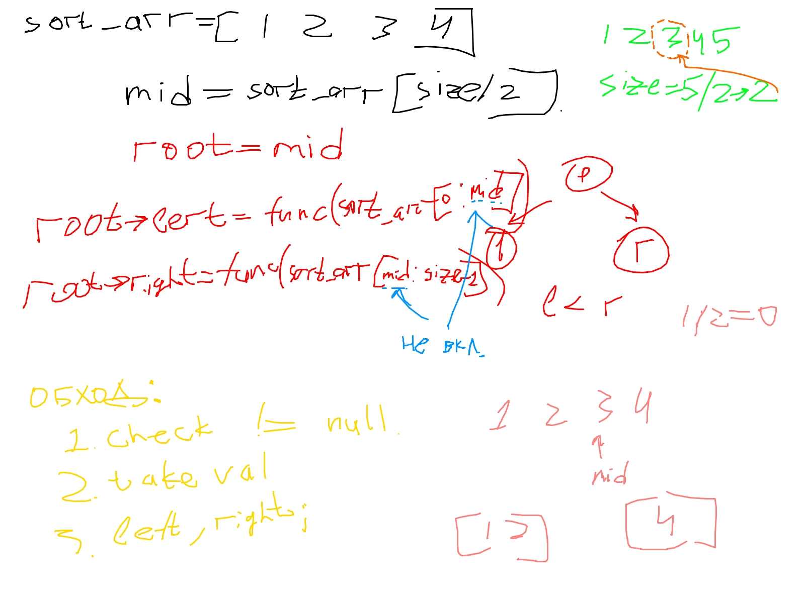

https://leetcode.com/problems/balance-a-binary-search-tree/description/?envType=daily-question&envId=2024-06-26

идея: отстортировать массив -> искать его середину и ставить в корень, оставшиеся эллементы сплитить относительно центра и повторять процедуру.
