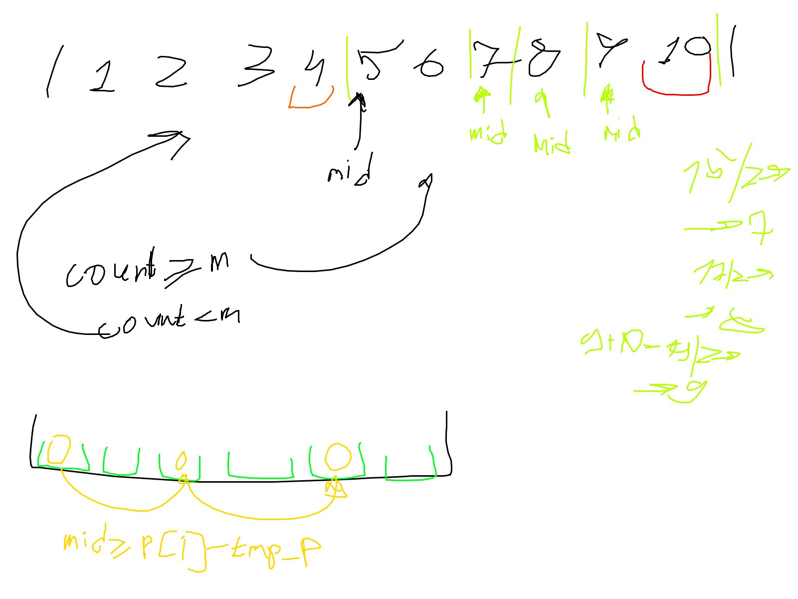

https://leetcode.com/problems/magnetic-force-between-two-balls/?envType=daily-question&envId=2024-06-20

Метод решения - бин поиск.

Для бин поиска:

1) посмотреть ограничения - 10^5 -> O(nlogn)

2) бин поиском ищут ответ всегда и проверяют его - проверяю влезут ли мячи при найденном расстоянии  

3) когда решил перебирать бин поиском переформулируй задачу

