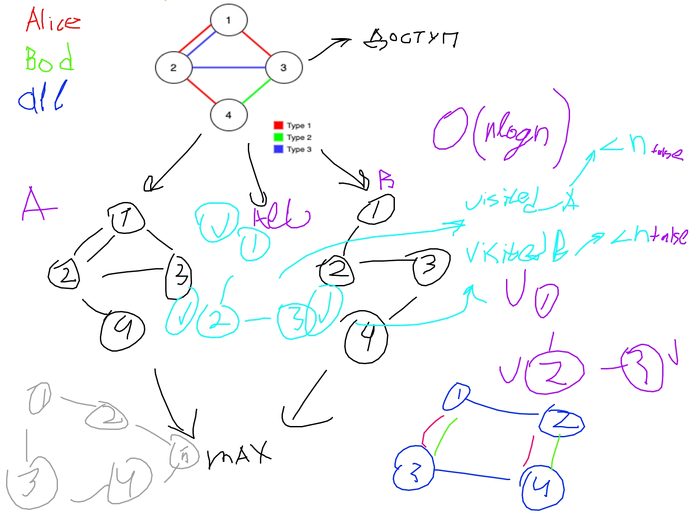

https://leetcode.com/problems/remove-max-number-of-edges-to-keep-graph-fully-traversable/description/?envType=daily-question&envId=2024-06-30

Идея решения:
1. Строим два графа для Alice и Bob
2. В приоритете type3 ребра (скорее всего все их добавляем)
3. С помощью структуры Disjoint Set Union (DSU)/Union-Find на этапе добавления нового ребра, вроверяем что оба узла в не в одой компоненте.

Статья про DSU - https://leetcode.com/discuss/general-discussion/1072418/Disjoint-Set-Union-(DSU)Union-Find-A-Complete-Guide

