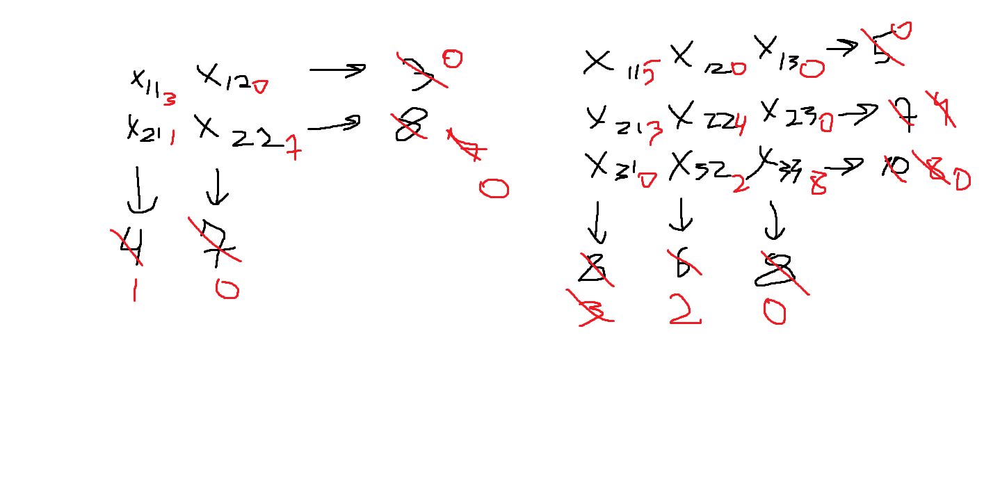

идея решения: 
1. проходим по матрицу слева -> направо, сверху -> вниз
2. на каждом [i][j] эллементе берем минимум из суммы строк и колонок и отнимаем от каждой из сумм минимум.
3. если суммы равны они старновятся равны нулю

