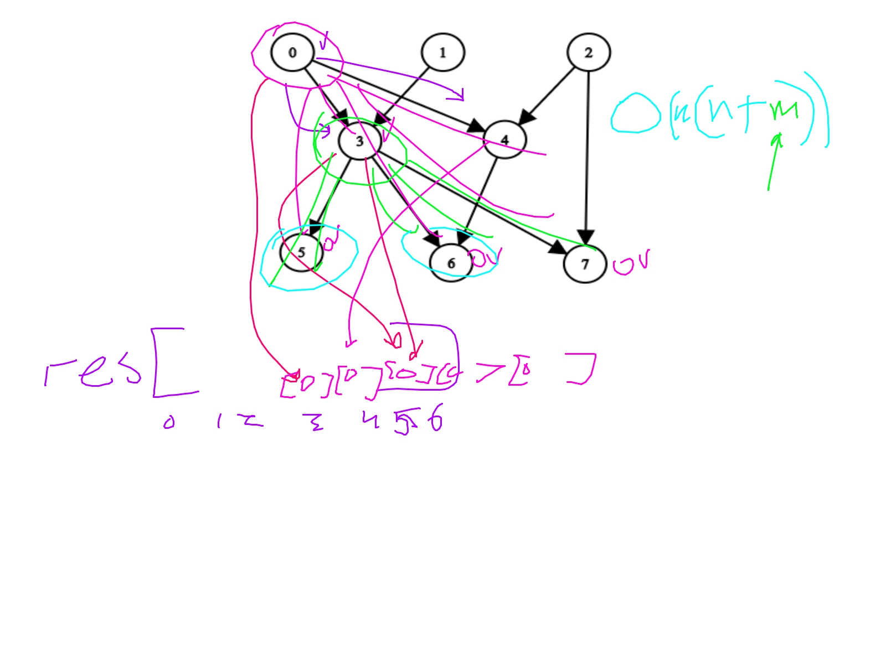

[2192. All Ancestors of a Node in a Directed Acyclic Graph](https://leetcode.com/problems/all-ancestors-of-a-node-in-a-directed-acyclic-graph/description/?envType=daily-question&envId=2024-06-29)

Основная идея: пройтись DFS'ом, помечая пройденные вершины, и для каждой из пройденных, докидывать родителей -> потом отсортить каждый список.

